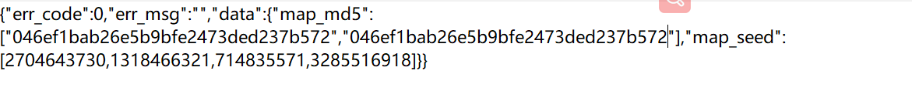

# FiddlerForSheepSkin

##### ios端羊了个羊通关获取皮肤，Fiddler

1. 首先去  https://www.cnblogs.com/mini-monkey/p/11286264.html  看教程把Fiddler安装配置好。

2. 访问该链接 https://www.aliyundrive.com/s/fdXrJzQsivQ 下载旧版的3.6.0微信覆盖原来的微信，因为新版的Fiddler可能抓包不了

3. 打开Fiddler

   

然后打开微信，打开羊了个羊小程序，进入主界面。然后返回Fiddler界面，看看有没有箭头所标注的数据

若没有，则说明没有抓到羊了个羊的包，然后去https://blog.csdn.net/weixin_46552558/article/details/124037807 按照步骤操作，微信重启后打开羊了个羊，回到Fiddler发现就能抓到上图中的包了。

4.接着手机电脑连接同一网络，使手机和电脑在同一个局域网环境下。电脑win+R 输入cmd ，在黑框里输入ipconfig查看电脑ip地址

然后打开iphone，找到连接的WiFi，点旁边的i图标，点击配置代理，选择手动，服务器填入电脑的ip端口8888，然后保存。接着打开浏览器输入 你的电脑ip:8888   例如 192.168.137.1:8888 ,跳转到页面后，点击最后一行的蓝字，然后安装描述文件，开启证书。

5.打开Fiddler，然后手机打开羊了个羊，进入到主界面，点击开始游戏

找到这条记录

选中后鼠标右击，保存-响应-响应主题  任意命名把文件保存到桌面

然后记事本打开刚才的文件

复制黄色的内容替换掉红色的内容

然后保存，打开Fidler，点击自动响应

找到刚才保存的文件 选中后点击右上角保存按钮

最后手机打开羊了个羊，开始游戏，发现第二关和第一关一样了！

